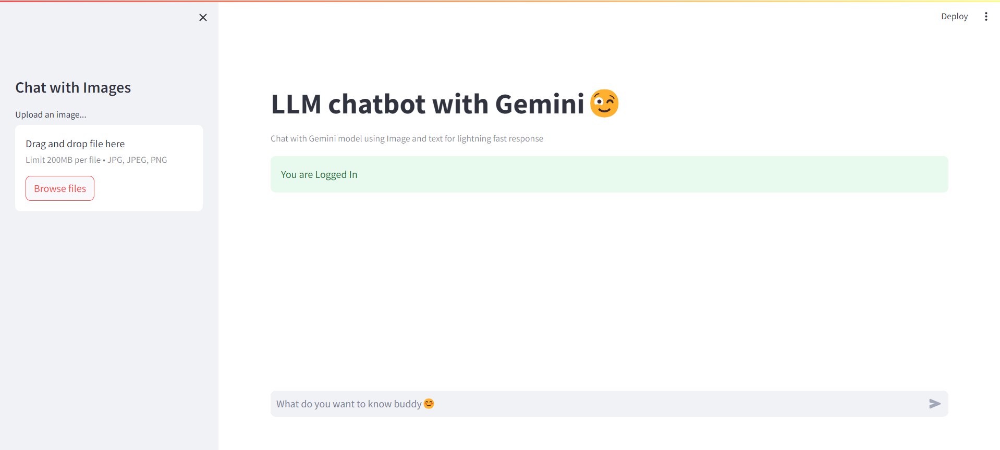

# Project Title Chatbot application



## API Reference

```http
Get your API key from below Link  
```

| Parameter | Type     | Description                |
| :-------- | :------- | :------------------------- |
| `api_key` | `string` | **Required** https://aistudio.google.com/app/apikey |


## Installation
```bash
open terminal
➡️cd chatQuery  
➡️pip install requirements.txt 
➡️ streamlit run app.py
```
😊before running app paste your``` Gemini Key in [.env]``` file.

```
for login into application type below hardcoded details in login page.


user -[chat]
pass -[0000]
```


    
